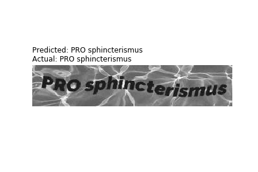
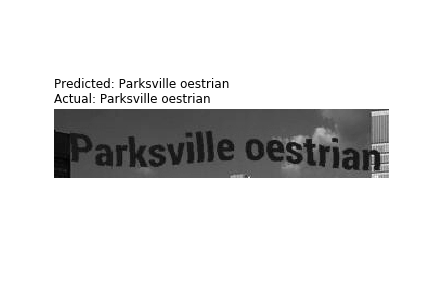
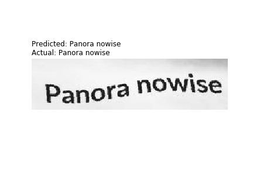
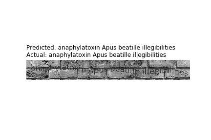
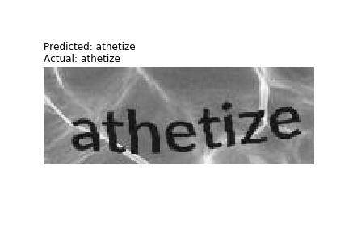
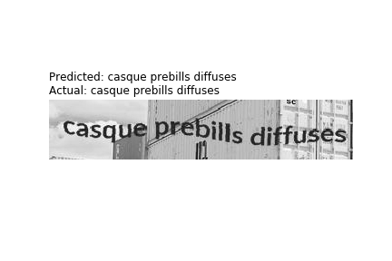

# CRNN OCR
 - Here, the model uses renet50 as the image feature extractor, which return feature maps which are downsampled by a factor of 4 with respect to the input image, which is then followed by stacked bilateral lstm layer to learn the sequence of characters.
 - Finally a softmax classifier outputs a probablity distribution, which the CTC loss uses to decode the final sequence
 
 ## Sample outputs
 - The model was trained on 100,000 synthetically generated word images, with the number of words varying between 1 and 4
 
 
 
 
 
 
  
